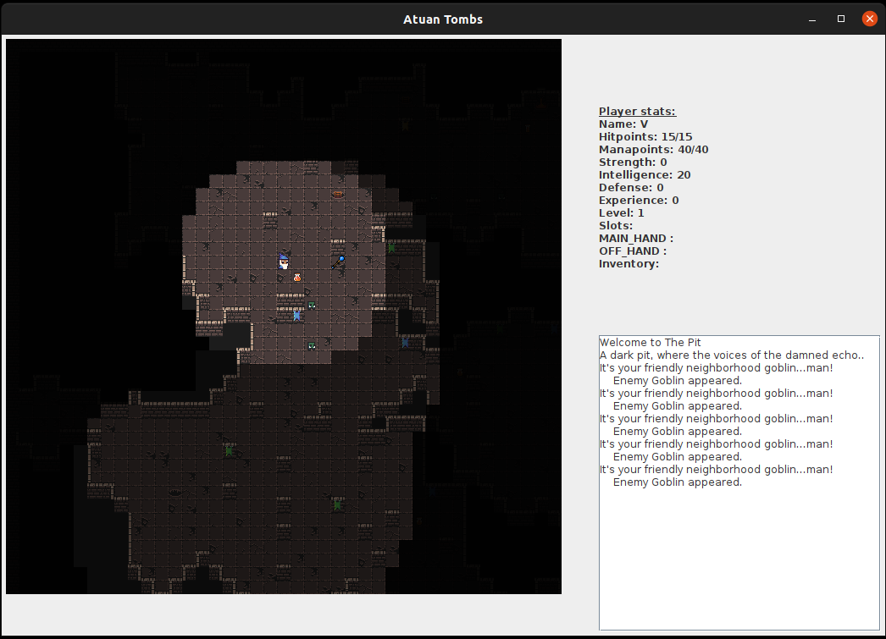
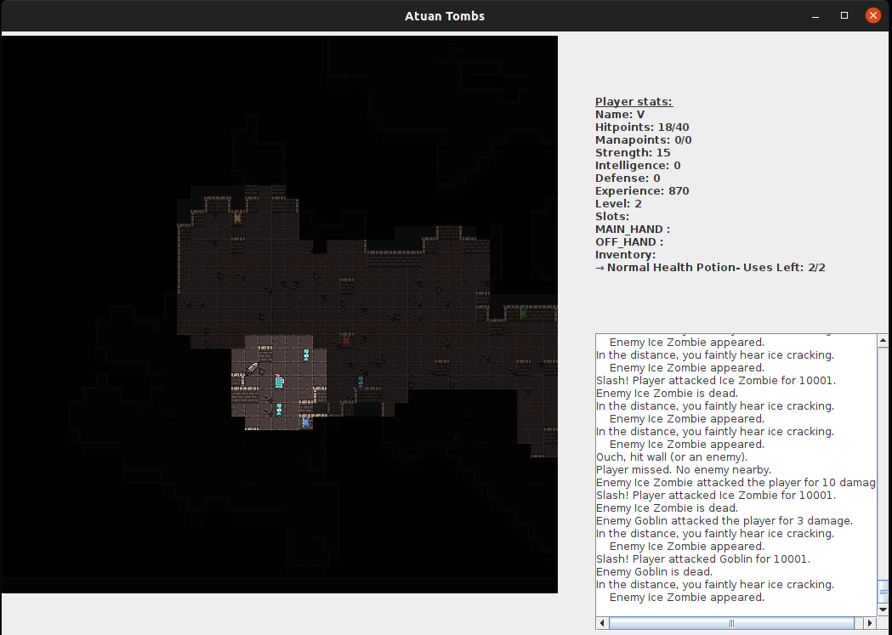

* Game Screenshots

* Files containing an entry main() function:
    * FullGame.java for Game with Starting, Winning and Losing screens.
        * Starting screen
            * 1st TextField: 'Warrior' or 'Wizard' for choosing Player Class.
            * 2nd TextField: Player name (must be non empty).
            * 3rd TextField: 'debug' for one-shooting enemies (Player deals 10001 damage). I've implemented it to make the game easier to beat, regardless of the stats for the player, the enemies and the items.

    * OnlyGamePanel.java only for Game Panel with no support for winning or losing. (for easier access to game / debugging)

    
* Controls

  | Key        | Action           |
  | :-------------: |:-------------:|
  | W/A/S/D  | Player movement |
  | SPACE     | Player attack |   
  | F | Go to next room |
  | U | Use potion (marked by Inventory Cursor) |
  | P | Drop potion (marked by Inventory Cursor) |
  | \[ / \] | Move Inventory Cursor (Up/Down respectively) |
  | T | Pick-up Weapon & Drop existing Weapon (if exists) |
  | G | Pick-up Shield & Drop existing Shield (if exists) |
  | R | Rest (+5HP for Warrior, +5HP +5MP for Wizard) |

* Map Generation

    * Generated a 60x60 grid of tiles with a random probability [0.41-0.5] (fixed for a given room) of a tile being Floor or Wall.

    * Ran an iteration of Cellular Automata using the 4-5 Rule: For any given tile, if it has
      <=3 surrounding Walls (counting all 8 surrounding tiles), it becomes a Floor. 
      If is has >=5 surrounding Walls, it becomes a Wall. Otherwise, its type stays the same.

    * Floodfilled the map starting from a random Floor position to eliminate "islands" 
      (areas which share no connections with the main area).

    * Created and sorted 9 maps by ascending fill-rate order. Set a threshold of fill-rate 0.3 for the map 
      to be sufficiently large. Assigned each map to a room, trying to match the fillrates
      given at 'description.pdf'.

* Enemies

    * Each enemy has an instance of the A* class and runs the A* algorithm at each step to find the best path from his
      location to the player. Its next move will be the first move in the optimal path.
    
    * Every player move triggers the spawning of an enemy, except moving the Inventory Cursor.

    * Enemies spawn with a probability of: 0.25*(1-exp(-4*player_HP/player_HP_max))
      
    * Changed enemy names to match the [sprites](https://0x72.itch.io/dungeontileset-ii) I used, while keeping the same
      stats.

      GiantRat -> Goblin

      MadGuard -> Ice Zombie

      Skeleton -> Swampy

      SkeletonLord -> OrcShaman

      Shade -> Necromancer
    
      Nameless One -> Demon
    
    * Maximum 5 enemies per map.
    

* Potions / Usables

    * Three rarities: Minor, Normal, Supreme with each rarity giving a higher replenishment of stats (HP/MP).

    * Three types: Health (only replenishing HP), Mana (only replenishing MP), Restoration (replenishing both).

      A Warrior only finds Health potions (he doesn't have MP), a Wizard can find all of them.

    * 5 potions per map. After entering a new room, the potions are initialized to 5, even if the player has entered the
      room before.

    * Automatically picked up by the player, if the potion can fit in the Inventory (maximum Inventory size = 10). The dropped potions just disappear.

* Weapons / Equippables

    * Followed the method given at the pdf of the project. Each equippable has 2 stats, a main and a secondary such
      that: main_stat + secondary_stat = itemlevel = 5*player_level + 5

    * Equipped at:
        * MAIN_HAND: Sword, Axe, Staff
        * OFF_HAND: Shield

    * The Warrior can find: Sword, Axe, Shield, the Wizard can find: Staff, Shield.

    * 4 equippables per map, initialized to 4 every time the player enters a room.
    
    * The dropped equippables are placed on the map, at the player position.

